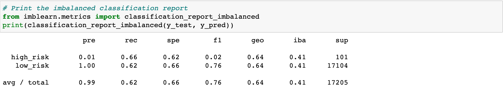
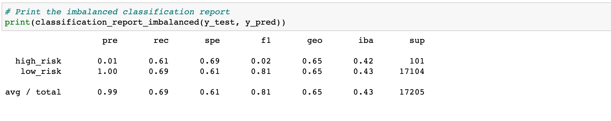
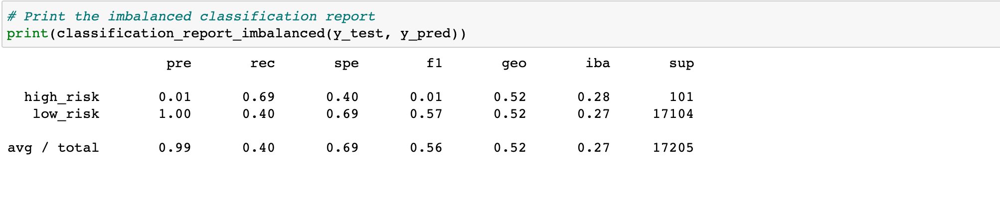
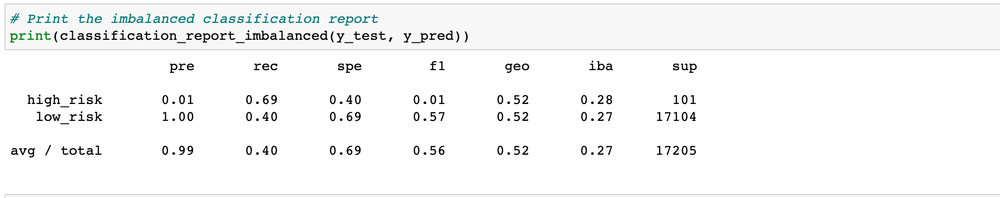
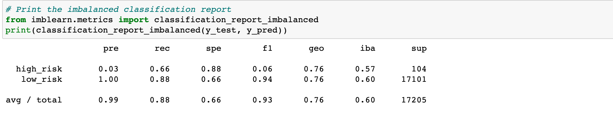
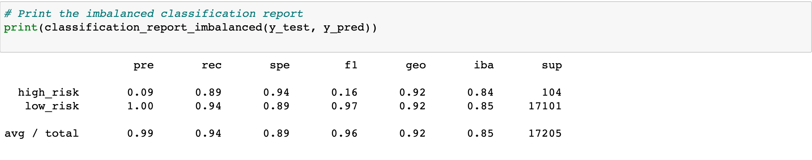

# Credit_Risk_Analysis
## Overview
Utilizing the data given to us, we were tasked with analyzing credit risk and creating predictive supervised machine learning models to identify individuals who are at an elevated credit risk level. 
## Results
### Naive Random Oversampling
- Balanced accuracy score was 64% . Precision was 99% . Recall was 62%. 

### SMOTE Oversampling
- Balanced accuracy score was 65% . Precision was 99% . Recall was 69%. 

### Undersampling
- Balanced accuracy score was 52% . Precision was 99% . Recall was 40%. 

### Combination
- Balanced accuracy score was 52% . Precision was 99% . Recall was 40%. 

### Balanced Random Forest Classifier
- Balanced accuracy score was 76% . Precision was 99% . Recall was 88%. 

### Easy Ensemble AdaBoost
- Balanced accuracy score was 92% . Precision was 99% . Recall was 94%. 

## Summary
### Recommendation
It is my recommendation based on the above images that the Easy Ensemble AdaBoost be the model of choice for this data as it boasts the highest precision, recall, and accuracy score of all tested models. 
